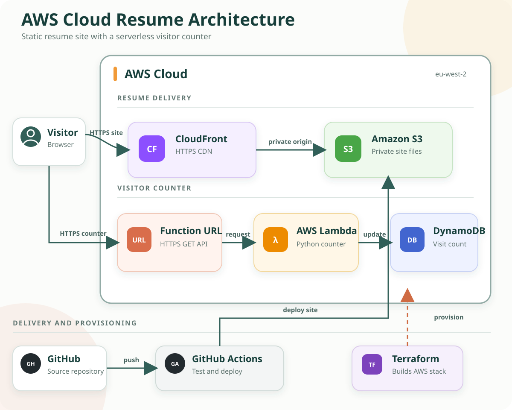

# AWS Cloud Resume Challenge

[](https://github.com/dorrellettienne/aws-cloud-resume-challenge/actions/workflows/validate.yml)

This project is a cloud-hosted resume website built with AWS. It started as the AWS Cloud Resume Challenge and was expanded into a small serverless application with infrastructure, testing, and deployment automation.

The live AWS infrastructure is currently offline, so the custom domain may not load. The code is still available, the site can run locally, and the Terraform files can be used to rebuild the AWS environment.

## What It Does

- Shows a responsive resume website.
- Tracks how many people have visited the site.
- Stores the visitor count in AWS DynamoDB.
- Uses an AWS Lambda function to update the counter.
- Uses Terraform to define the AWS infrastructure as code.
- Uses GitHub Actions to test the project and support automated deployment.

## Architecture



## How It Works

1. A visitor opens the resume website.
2. AWS CloudFront serves the website from a private S3 bucket.
3. The browser calls a Lambda Function URL to get the visitor count.
4. Lambda updates the count in DynamoDB.
5. The updated count appears on the page.

In simple terms: the resume is the frontend, Lambda is the backend, DynamoDB is the database, and Terraform describes the cloud setup.

## Technology Used

| Part | Tools |
| --- | --- |
| Website | HTML, CSS, JavaScript |
| Cloud hosting | Amazon S3, Amazon CloudFront |
| Visitor counter | AWS Lambda, Python, DynamoDB |
| Infrastructure | Terraform |
| Automation | GitHub Actions |
| Security | Private S3 bucket, CloudFront access control, IAM permissions |
| Testing | Pytest, Terraform validation |

## Project Structure

```text
.
|-- .github/workflows/   # GitHub Actions validation and deployment
|-- Resume/              # Resume website files
|-- infra/               # Terraform AWS infrastructure
|-- infra/lambda/        # Python Lambda visitor counter
|-- tests/               # Lambda tests
`-- requirements-dev.txt # Python test dependencies
```

## Run The Website Locally

The website does not need a build step.

```powershell
python -m http.server 8000
```

Then open:

```text
http://localhost:8000/Resume/
```

The visitor counter will show `Available when deployed` when running locally because the public AWS API URL is not included in the repo.

## Run The Tests

```powershell
python -m venv .venv
.venv\Scripts\Activate.ps1
python -m pip install -r requirements-dev.txt
python -m pytest -q
```

## Rebuild The AWS Infrastructure

You need Terraform, an AWS account, and AWS credentials before running these commands.

```powershell
cd infra
terraform init
terraform plan
terraform apply
```

Terraform will create the main AWS resources, including S3, CloudFront, Lambda, DynamoDB, and the required IAM permissions.

To remove the AWS resources:

```powershell
cd infra
terraform destroy
```

## Notes

- The AWS deployment is currently turned off.
- Terraform state files and generated deployment files are ignored by Git.
- The S3 bucket is private and is meant to be accessed through CloudFront.
- The Lambda function is public only so the website can call the visitor counter.
- The resume content in `Resume/index.html` is public because this is a public GitHub repository.
