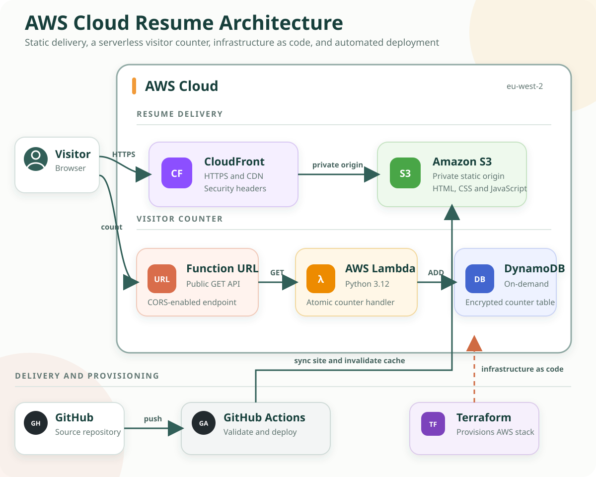

# AWS Cloud Resume Challenge

[](https://github.com/dorrellettienne/aws-cloud-resume-challenge/actions/workflows/validate.yml)

A serverless resume application built with AWS, Terraform, Python, and GitHub Actions. The project combines a responsive static site with an atomic visitor counter, infrastructure as code, automated validation, and a gated deployment workflow.

> **Current status:** The AWS infrastructure and custom domain are offline. The application can still be run locally, and the Terraform configuration is ready to create a new deployment.

## Architecture



### Request flow

1. CloudFront serves the resume over HTTPS from a private S3 origin.
2. The browser requests the current count from a public Lambda Function URL.
3. Lambda uses a single DynamoDB `UpdateItem` operation to increment and return the count atomically.
4. The page updates the counter without reloading.

## What Is Included

| Area | Implementation |
| --- | --- |
| Frontend | Semantic HTML, responsive CSS, accessible navigation, and print styles |
| API | Public Lambda Function URL with GET-only application handling |
| Compute | Python 3.12 Lambda function using Boto3 |
| Data | On-demand DynamoDB table with encryption and point-in-time recovery |
| Delivery | Private S3 origin behind CloudFront with HTTPS and security headers |
| Infrastructure | Terraform configuration for the complete AWS stack |
| CI | Python tests plus Terraform formatting and validation |
| CD | Gated GitHub Actions deployment using AWS OIDC credentials |

## Design Decisions

- **Atomic counter updates:** DynamoDB `ADD` avoids lost updates when multiple visitors arrive at the same time.
- **Private static origin:** S3 public access is blocked; CloudFront receives read access through Origin Access Control.
- **Least-privilege application role:** Lambda can update only the visitor-counter table, plus write its standard CloudWatch logs.
- **No deployment credentials in GitHub:** The deployment workflow expects an AWS role assumed through GitHub's OIDC token.
- **Safe offline behaviour:** The local site displays a deployment status instead of failing when no counter URL is configured.
- **Controlled deployment:** `AWS_DEPLOY_ENABLED` must be set to `true` before the deployment job can run.

## Repository Structure

```text
.
|-- .github/
|   |-- workflows/
|   |   |-- deploy.yml       # Gated S3 and CloudFront deployment
|   |   `-- validate.yml     # Python tests and Terraform checks
|   `-- dependabot.yml       # Monthly dependency update checks
|-- Resume/
|   |-- index.html           # Resume content and semantic structure
|   |-- style.css            # Responsive screen and print design
|   |-- app.js               # Visitor-counter client
|   `-- config.js            # Empty local runtime configuration
|-- infra/
|   |-- lambda/func.py       # Atomic visitor-counter Lambda
|   |-- main.tf              # AWS resources and IAM
|   |-- outputs.tf           # Deployment values
|   |-- provider.tf          # Terraform and provider versions
|   `-- variables.tf         # Region, project, and environment settings
|-- tests/test_func.py       # Lambda unit tests
`-- requirements-dev.txt
```

## Run Locally

The frontend has no build step.

```powershell
python -m http.server 8000
```

Open:

```text
http://localhost:8000/Resume/
```

The visitor counter will display `Available when deployed` because the committed `Resume/config.js` intentionally contains no API endpoint.

## Test

Create a virtual environment and run the Lambda tests:

```powershell
python -m venv .venv
.venv\Scripts\Activate.ps1
python -m pip install -r requirements-dev.txt
python -m pytest -q
```

Validate the Terraform configuration:

```powershell
cd infra
terraform fmt -check -recursive
terraform init -backend=false
terraform validate
```

## Deploy the Infrastructure

You need Terraform, an AWS account, and AWS credentials with permission to create the resources in `infra/`.

```powershell
cd infra
terraform init
terraform plan
terraform apply
```

The useful deployment values are available as Terraform outputs:

```powershell
terraform output site_url
terraform output counter_url
terraform output resume_bucket_name
terraform output cloudfront_distribution_id
```

Terraform state is ignored by Git. For a shared or long-lived deployment, configure an encrypted remote backend before applying.

## Configure Deployment

The deployment workflow is disabled until its GitHub configuration is present.

Create these repository variables:

| Variable | Value |
| --- | --- |
| `AWS_DEPLOY_ENABLED` | `true` when the AWS stack is ready |
| `AWS_REGION` | Terraform region, default `eu-west-2` |
| `AWS_S3_BUCKET` | Value of `resume_bucket_name` |
| `AWS_CLOUDFRONT_DISTRIBUTION_ID` | Value of `cloudfront_distribution_id` |
| `COUNTER_API_URL` | Value of `counter_url` |

Create one repository secret:

| Secret | Purpose |
| --- | --- |
| `AWS_ROLE_TO_ASSUME` | IAM role trusted by GitHub Actions through OIDC |

The role needs permission to update the resume bucket and create invalidations for the CloudFront distribution. When enabled, changes under `Resume/` deploy automatically after a push to `main`; deployment can also be started manually.

## Security Notes

- Terraform state, generated ZIP files, local environments, and editor settings are excluded from version control.
- The S3 bucket blocks all public access and is readable only through the CloudFront distribution.
- The Lambda execution role is scoped to one DynamoDB table.
- The Lambda Function URL is intentionally public so a browser can call it. Reserved concurrency limits the function to five simultaneous executions, but a production deployment should also use AWS budgets and monitoring.
- The repository contains a public resume, including an email address, LinkedIn profile, employment history, and education details.

## Tear Down

AWS resources may incur charges. Remove a deployment when it is no longer needed:

```powershell
cd infra
terraform destroy
```
